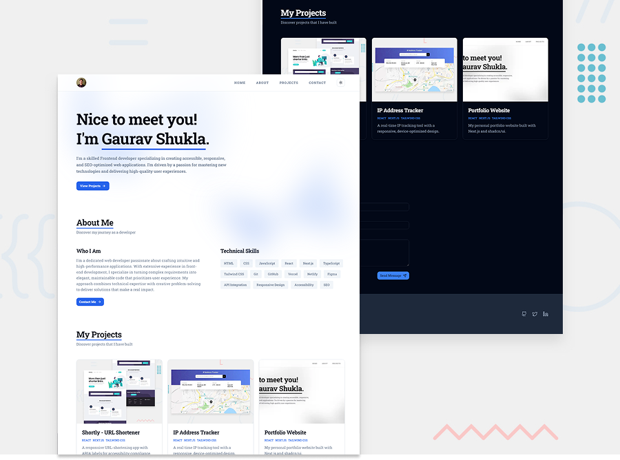

# Gaurav Shukla's Portfolio

This is the Git repository for my personal [portfolio](https://heygauravshukla.vercel.app/) website, built with Next.js and shadcn/ui to showcase my web development skills and projects.

## Table of contents

- [Overview](#overview)
  - [The challenge](#the-challenge)
  - [Screenshot](#screenshot)
  - [Links](#links)
- [My process](#my-process)
  - [Built with](#built-with)
  - [What I learned](#what-i-learned)
  - [Continued development](#continued-development)
  - [Useful resources](#useful-resources)
- [Author](#author)
- [Acknowledgments](#acknowledgments)

## Overview

### The challenge

Users should be able to:

- Browse my portfolio website from any device with a responsive layout.
- View the website in their preferred color scheme (light/dark mode).
- Access the site with WCAG-compliant features for users with disabilities.
- Navigate fully using keyboard controls for enhanced accessibility.

### Screenshot



_Desktop view of the portfolio showcasing the hero section and layout._

### Links

- Source Code: [https://github.com/yoursgaurav/portfolio](https://github.com/yoursgaurav/portfolio)
- Live Site URL: [https://heygauravshukla.vercel.app/](https://heygauravshukla.vercel.app/)

## My process

### Built with

- Semantic HTML5 markup
- Container queries
- Mobile-first workflow
- Utility-first CSS classes
- [React](https://reactjs.org/) - JS library
- [Next.js](https://nextjs.org/) - React framework
- [Tailwind CSS (v4)](https://tailwindcss.com/) - Utility-first CSS framework
- [shadcn/ui](https://ui.shadcn.com/) - Accessible UI component library
- [Lucide](https://lucide.dev/) - Beautiful & consistent icon set
- [EmailJS](https://www.emailjs.com/) - Client-side email service

### What I learned

- Using shadcn/ui to build a custom component library efficiently.
- Applying container queries in Tailwind CSS v4 to style child elements based on parent container size rather than viewport.
  ```jsx
  <header className="... @container ...">
    <Wrapper className="... @5xl:py-4">...</Wrapper>
  </header>
  ```
- Integrating services like EmailJS for functional contact forms without a backend or database.
  ```jsx
  try {
    const result = await emailjs.send(
      EMAILJS_SERVICE_ID,
      EMAILJS_TEMPLATE_ID,
      {
        name: formData.name,
        email: formData.email,
        message: formData.message,
      },
      EMAILJS_PUBLIC_KEY
    );
    // ...
  }
  ```
- Leveraging TypeScript for type-safe component props and form data management.
- Harnessing AI tools to accelerate application development while securing sensitive data with environment variables.

### Continued development

- Develop individual project pages with detailed case studies for each portfolio item.
- Enhance website design to meet WCAG standards for accessibility.
- Implement subtle animations using Tailwind CSS, with opt-out options for users preferring reduced motion.

### Useful resources

- [shadcn/ui docs](https://ui.shadcn.com/) - Guided me in creating a custom component library with shadcn/ui.
- [Tailwind CSS container queries guide](https://tailwindcss.com/docs/upgrade-guide#container-configuration) - Clarified how to implement container queries in Tailwind CSS v4.
- [Next.js Documentation](https://nextjs.org/docs) - Essential for mastering Next.js 15 features.

## Author

- X - [@heygauravshukla](https://www.x.com/heygauravshukla)
- LinkedIn - [@heygauravshukla](https://www.linkedin.com/in/heygauravshukla)

## Acknowledgments

- **Frontend Mentor**: For inspiring me with practical challenges that shaped this portfolio’s project section.
- **Design Inspirations**:
  - [Ram Maheshwari's portfolio](https://www.rammaheshwari.com/) - Influenced the header and about section layout.
  - [FEM challenges page](https://www.frontendmentor.io/challenges) - Guided the projects section design.
  - [FEM Single-page developer portfolio](https://www.frontendmentor.io/challenges/singlepage-developer-portfolio-bBVj2ZPi-x) - Shaped the hero text and footer styling.
  - [shadcn/ui homepage](https://ui.shadcn.com/) - Inspired the hero section’s clean aesthetic.
