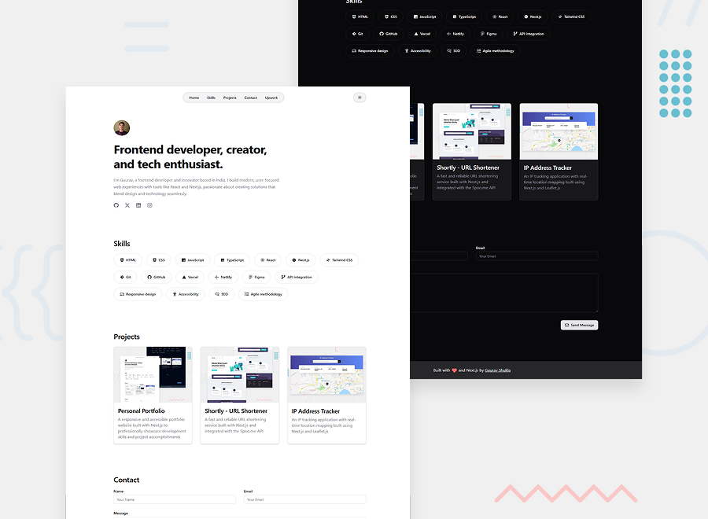

# Gaurav Shukla's Portfolio

This is the Git repository for my personal [portfolio](https://heygauravshukla.vercel.app) website, built with Next.js and shadcn/ui to showcase my web development skills and projects.

## Table of contents

- [Overview](#overview)
  - [The challenge](#the-challenge)
  - [Screenshot](#screenshot)
  - [Links](#links)
- [My process](#my-process)
  - [Built with](#built-with)
  - [What I learned](#what-i-learned)
  - [Useful resources](#useful-resources)
- [Author](#author)
- [Acknowledgments](#acknowledgments)

## Overview

### The challenge

Visitors can:

- Browse my portfolio website from any device with a responsive layout.
- View the website in their preferred color scheme (light/dark mode).
- Access the site with WCAG-compliant features for users with disabilities.
- Navigate fully using keyboard controls for enhanced accessibility.

Additional development challenges included:

- Centralizing content management without modifying individual components.
- Creating consistent case study pages for the projects.

### Screenshot



_Desktop view of the portfolio._

### Links

- Source Code: [https://github.com/yoursgaurav/portfolio](https://github.com/yoursgaurav/portfolio)
- Live Site URL: [https://heygauravshukla.vercel.app](https://heygauravshukla.vercel.app)

## My process

### Built with

- Semantic HTML5 markup
- Mobile-first workflow
- Utility-first CSS classes
- Next.js Static Site Generation (SSG)
- [React](https://reactjs.org) - JS library
- [Next.js](https://nextjs.org) - React framework
- [Tailwind CSS (v4)](https://tailwindcss.com) - Utility-first CSS framework
- [shadcn/ui](https://ui.shadcn.com) - Accessible UI component library
- [Lucide](https://lucide.dev) - A beautiful and consistent icon set
- [EmailJS](https://www.emailjs.com) - Client-side email service

### What I learned

- Using shadcn/ui to build a custom component library efficiently.

- Integrating services like EmailJS for functional contact forms without a backend or database.

  ```jsx
  try {
    const result = await emailjs.send(
      EMAILJS_SERVICE_ID,
      EMAILJS_TEMPLATE_ID,
      {
        name: formData.name,
        email: formData.email,
        message: formData.message,
      },
      EMAILJS_PUBLIC_KEY
    );
    // ...
  }
  ```

- Leveraging TypeScript for type-safe component props and form data management.
- Using a `constants/` directory to centralize content management, reducing the need to dig into individual components for updates.
- Implementing Next.js static site generation with `app/projects/[slug]/page.tsx` to create individual project case study pages that are consistent, maintainable, and avoid code duplication.
- Using AI tools to accelerate development while ensuring security through environment variables.

### Useful resources

- [shadcn/ui docs](https://ui.shadcn.com/docs) - Guided me in creating a custom component library with shadcn/ui.
- [Next.js docs](https://nextjs.org/docs) - Essential for mastering Next.js 15 features.

## Author

- X - [@heygauravshukla](https://www.x.com/heygauravshukla)
- LinkedIn - [@heygauravshukla](https://www.linkedin.com/in/heygauravshukla)

## Acknowledgments

These are some of the websites that I took design inspiration from:

- [Spotlight - Tailwind CSS Personal Website Template](https://tailwindcss.com/plus/templates/spotlight)
- [Frontend Mentor](https://www.frontendmentor.io)
